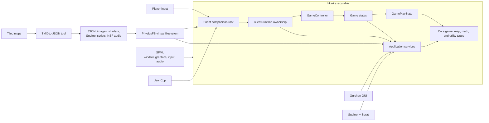
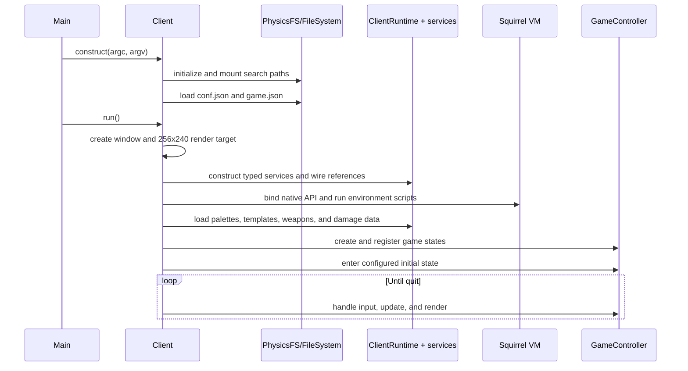
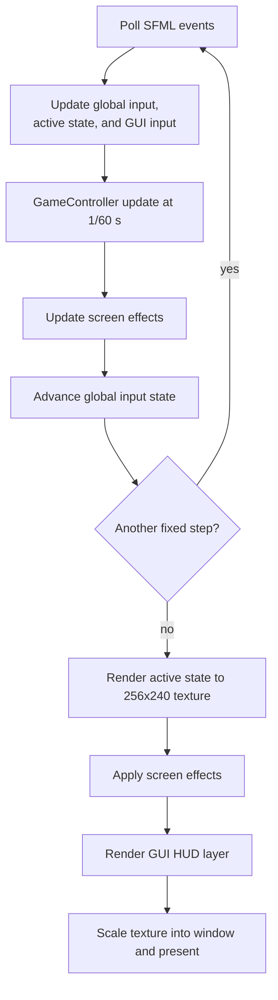
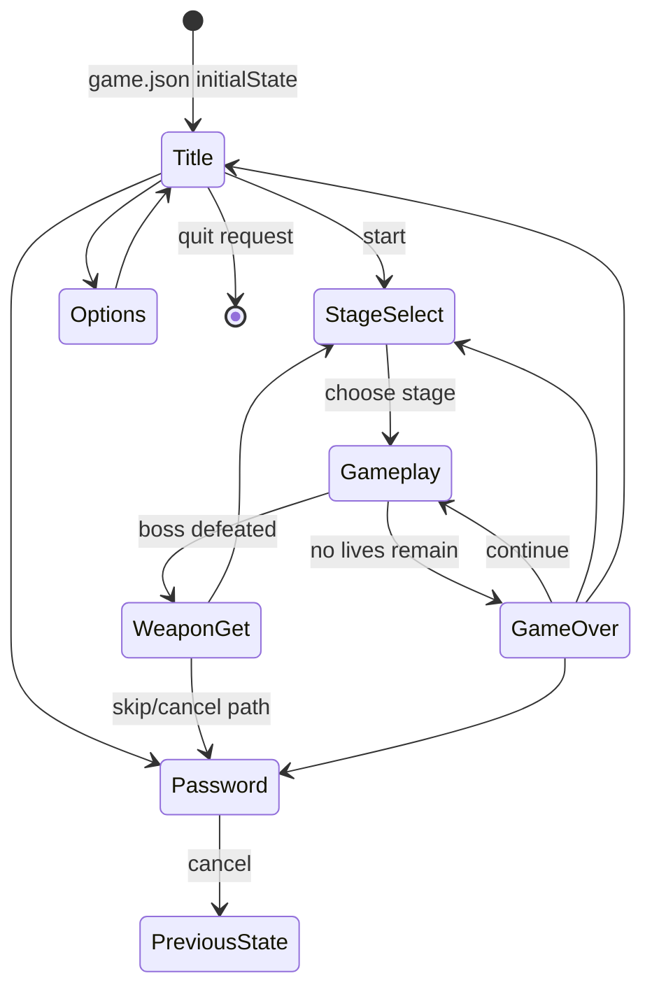
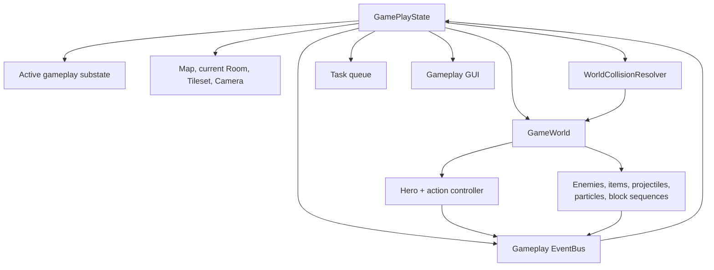
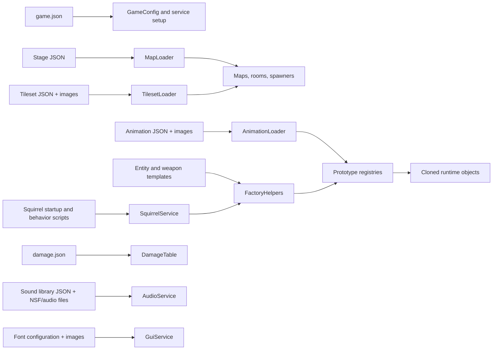

# Hikari architecture

This document describes Hikari's current, as-built architecture. It is a map of
the major runtime pieces, their responsibilities, and the paths that connect
source code to playable content. It is intended to be a shared baseline for
future refactoring and enhancement planning, not a proposal for a target
architecture.

## System at a glance

Hikari is a data-driven C++17 desktop game. CMake builds the engine, game, and
most third-party source into an internal static library linked by the `hikari`
executable and runtime tests. At runtime, a `Client`
composition root creates platform resources and application services, loads
JSON and Squirrel content through a virtual filesystem, registers the game's
screens with a state controller, and runs a fixed-step game loop.

The source tree has two named layers, but they are organizational rather than
strictly isolated modules:

| Area | Role |
|---|---|
| [`engine/src/hikari/client`](../engine/src/hikari/client) | Application startup, game-specific states, gameplay orchestration, entities, GUI, audio, and scripting integration |
| [`engine/src/hikari/core`](../engine/src/hikari/core) | Reusable game-state, animation, map, collision, math, filesystem, cache, and utility types |
| [`engine/include/hikari`](../engine/include/hikari) | Public declarations mirroring the `client` and `core` source trees |
| [`content`](../content) | Runtime configuration and assets: maps, templates, animation definitions, scripts, images, shaders, and sound data |
| [`tools/map-converter`](../tools/map-converter) | Authoring-time conversion from Tiled TMX maps to Hikari's JSON map format |
| [`tests`](../tests) | Catch-based core tests and runtime lifetime, injection, and production-state regression tests |
| [`extlibs`](../extlibs) | Libraries compiled into the runtime static library, including Squirrel, Sqrat, JsonCpp, Guichan, and Game Music Emu |

## Runtime composition and lifecycle

[`Main.cpp`](../engine/src/hikari/client/Main.cpp) constructs a
[`Client`](../engine/include/hikari/client/Client.hpp) and calls `run()`.
`Client` owns the top-level resources for the process: the SFML window and
logical render target, configuration, and the process quit flag.
[`ClientRuntime`](../engine/include/hikari/client/ClientRuntime.hpp) owns the
controller and typed application services. It is used only by the composition
root; states and loaders receive their individual dependencies by reference.

Startup follows this order:

1. The `Client` constructor initializes logging and
   [PhysicsFS](../engine/src/hikari/core/util/PhysFS.cpp), then mounts the
   executable directory, `content.zip`, and optional `custom.zip` as virtual
   filesystem search locations.
2. `conf.json` supplies client settings, while `game.json` supplies content
   paths, GUI definitions, startup scripts, state configuration, and the
   initial state.
3. `run()` creates the SFML window and a fixed 256x240 `RenderTexture`. The
   window may scale that texture, but game rendering remains at the logical
   resolution.
4. `initServices()` constructs `ClientRuntime`, which owns the caches, loaders,
   prototype factories, input, GUI, audio, scripting, progress, event, and
   screen-effect services. Shader initialization belongs to the screen-effect
   instance and happens after the rendering environment exists.
5. `initGame()` loads palettes, executes startup scripts, converts JSON object
   templates into factory prototypes, loads damage values, creates the
   top-level game states, and selects the configured initial state.
6. `loop()` runs until a window close or global quit request sets the quit
   flag. RAII cleanup runs on normal exit and failed startup: scripting proxies
   and the global collision-resolver reference are cleared, states and gameplay
   objects are destroyed, then prototype factories, screen effects and GUI, the
   VM, remaining services and caches, shared graphics resources, render targets,
   window, and finally PhysicsFS.
   Guichan's global font and image-loader registrations are cleared by the GUI
   owner, including when its constructor fails.

### The frame loop

The loop in [`Client.cpp`](../engine/src/hikari/client/Client.cpp) uses a
fixed update interval of 1/60 second and an accumulator. A display frame can
therefore execute zero or more fixed simulation updates before one render.

The `GameController` delegates events, updates, and rendering to exactly one
top-level state. During a transition it delegates rendering and updating to
the active transition object instead. GUI state-specific widgets render into
the logical game target; the always-front HUD container is drawn later in the
window pipeline.

## Application state model

[`GameController`](../engine/src/hikari/core/game/GameController.cpp) stores
named `GameState` instances and switches between them. A requested switch can
run an outgoing and incoming `StateTransition`; the default transition is a
fade. Enter and exit hooks let each state attach or remove its GUI and reset
state-specific resources.

The concrete state objects live under
[`engine/src/hikari/client/game`](../engine/src/hikari/client/game). Menu-like
states primarily coordinate input, GUI, audio, progress, and the next
top-level transition. `GamePlayState` is the substantially larger runtime for
an active stage.

## Gameplay architecture

[`GamePlayState`](../engine/include/hikari/client/game/GamePlayState.hpp) is
the gameplay coordinator. It owns the active map/room references, camera,
hero and boss, the gameplay-local event bus, `GameWorld`, collision resolver,
gameplay GUI, task queue, and the active gameplay substate.

Gameplay uses a nested state model:

- **Ready** displays the stage-ready sequence.
- **Teleport** moves the hero into the stage.
- **Playing** runs player-controlled gameplay and most simulation work.
- **Transition** coordinates doors, camera motion, cleanup, and movement
  between rooms.
- **Boss defeated** sequences the end of a boss encounter and requests the
  top-level weapon-get state.

Substate changes are normally queued so an active substate is not destroyed
in the middle of its own update call. Independent scripted sequences, such as
energy refills and timed boss-introduction actions, use a FIFO queue of small
`Task` objects.

### World and object lifecycle

[`GameWorld`](../engine/src/hikari/client/game/GameWorld.cpp) holds the player,
current room, object registry, factories, and typed collections of items,
enemies, particles, and projectiles. Additions and removals are queued and
flushed at update boundaries, avoiding mutation of active collections while
they are being iterated. The registry supports event handlers that need to
resolve an object ID back to an object.

`GameWorld` is primarily an ownership and lifecycle boundary. The detailed
simulation order remains in `GamePlayState`: it updates entities and
projectiles, checks collisions and spawners, coordinates room transitions,
updates GUI/progress, and builds the z-ordered render list. Map foreground and
background layers surround renderable objects according to their z-index.

Entities share a common hierarchy:

- `GameObject` provides identity, active state, and update behavior.
- `Entity` adds position, velocity, bounding boxes/hit boxes, faction,
  damage identity, room/event links, animation, and render behavior.
- `Hero`, `Enemy`, `CollectableItem`, and `Projectile` specialize entity
  behavior.
- `Particle` and `BlockSequence` are renderable game objects outside the main
  entity hierarchy.
- Hero action controllers separate player input from cut-scene control.
- Enemy brains separate an enemy's data/state from its behavior, including
  Squirrel-backed behavior.

### Maps, rooms, and collision

[`MapLoader`](../engine/src/hikari/core/game/map/MapLoader.cpp) turns each map
JSON document into a `Map` containing a tileset, rooms, special-room indexes,
and boss metadata. Rooms contain tile and attribute arrays, camera bounds,
spawners, forces, doors, room transitions, and block-sequence descriptors.

Only one room is current for gameplay ownership and collision at a time.
`GamePlayState` links that room's spawners and block sequences, while
`WorldCollisionResolver` uses `GameWorld` to resolve movement against the
room and active obstacles. The camera selects the visible world region and is
also used to wake spawners and retire off-screen objects.

## Application services and communication

`Client` is the composition root. `ClientRuntime` declares service owners before
their consumers so reverse member destruction preserves dependency lifetimes.
Shared allocations are retained for compatibility with scripting proxies and
existing resource ownership, but required service dependencies in states,
tasks, loaders, and the world are non-owning references, not weak-pointer lookups.
The larger gameplay constructor uses a reference-only `GamePlayDependencies`
aggregate containing only its dependencies.

| Service group | Responsibilities |
|---|---|
| Assets | `ImageCache`, `AnimationSetCache`, `MapLoader`, plus their tileset and animation loaders |
| Object creation | Dependency-free prototype registries: `ItemFactory`, `EnemyFactory`, `ProjectileFactory`, and `ParticleFactory`; `FactoryHelpers` receives the caches and scripting dependencies used during loading |
| Game data | `GameProgress`, `WeaponTable`, and `DamageTable` |
| Interaction | `KeyboardInput` exposed directly as `Input`, `GuiService`, and `ScreenEffectsService` |
| Integration | `AudioService`, `SquirrelService`, and `EventBusImpl` exposed directly as `EventBus` |

There are two event scopes:

- The **global event bus** is owned by `ClientRuntime`, injected directly, and
  handles process-wide events such as a quit request.
- `GamePlayState` creates a **gameplay-local event bus** for weapon fire,
  damage, death, entity-state changes, doors, audio requests, and object
  removal.

[`EventBusImpl`](../engine/src/hikari/client/game/events/EventBusImpl.cpp)
supports immediate delivery and queued delivery. Queued events use two queues:
one receives new events while the other is processed, so handlers can safely
enqueue work for a later processing pass.

## Content and scripting pipeline

All runtime content reads pass through
[`FileSystem`](../engine/src/hikari/core/util/FileSystem.cpp), a stream-oriented
facade over PhysicsFS. This allows loose files and mounted archives to present
the same virtual paths to loaders.

The central [`game.json`](../content/game.json) names startup scripts and
paths for fonts, audio, stages, object templates, and weapons. Other JSON
documents define:

- sprite animations and palettes;
- tilesets, stages, rooms, transitions, and spawners;
- item, enemy, projectile, and particle prototypes;
- weapons and damage values;
- font atlases and the sound library.

[`FactoryHelpers`](../engine/src/hikari/client/game/objects/FactoryHelpers.cpp)
parses template documents once during startup and builds configured prototype
objects. The four object factories retain those prototypes and clone them when
the world or a spawner requests an object by name. This keeps content identity
string-based while avoiding reparsing templates during gameplay.

### Squirrel boundary

[`SquirrelService`](../engine/src/hikari/client/scripting/SquirrelService.cpp)
owns one Squirrel VM. During construction it registers standard math support
and native bindings for:

- logging and virtual-filesystem reads;
- audio playback;
- persistent game progress and weapon availability;
- gameplay energy refill operations;
- selected `GameObject`, `Entity`, `Enemy`, room, direction, and faction APIs.

Startup scripts listed in `game.json` establish the script environment and
load behavior/effect classes. JSON templates name those classes:
`ScriptedEnemyBrain` delegates enemy behavior to Squirrel, and
`ScriptedEffect` delegates item effects. Native proxy classes provide scripts
with access to selected C++ services. Proxies remain static weak bindings, but
the runtime explicitly clears them before destroying their targets. VM-backed
brains, effects, and prototypes must be destroyed before the scripting runtime.

## Rendering, GUI, and audio

SFML supplies the window, event types, graphics primitives, shaders, render
targets, and audio streaming base classes. The game renders pixel art to the
fixed-size texture, applies palette and full-screen shader effects, then
scales the result to the window.

[`GuiService`](../engine/src/hikari/client/gui/GuiService.cpp) adapts Guichan
to SFML. It owns a root widget with two layers:

- a root container where the active game state attaches its widgets;
- a HUD container for overlays that must remain in front.

[`AudioService`](../engine/src/hikari/client/audio/AudioService.cpp) loads
music/sample configuration through `SoundLibrary`. Game Music Emu support
allows NSF sources, while SFML provides the output stream integration.
States and gameplay code can call the service directly; scripts use the
audio proxy; gameplay objects can also request sounds through local events.

## Build, dependencies, and tests

The root [`CMakeLists.txt`](../CMakeLists.txt) targets C++17 and adds the
engine and test directories. By default, CMake fetches pinned SFML and
PhysicsFS versions; system packages can be selected instead.

[`engine/CMakeLists.txt`](../engine/CMakeLists.txt) compiles Hikari and vendored
sources into the internal `hikari-runtime` static library, linked by the
`hikari` executable and runtime tests. It links SFML and PhysicsFS and copies
the complete `content` directory beside the executable. The library is a test
reuse boundary, not a plugin or a separation of the `core` and `client` layers.

The vendored source graph includes JsonCpp, Squirrel/Sqrat, Guichan and its
SFML adapters, PhysicsFS stream adapters, and Game Music Emu. The
[`tests` target](../tests/CMakeLists.txt) covers math/geometry, movement, and
`EventBusImpl` using a small production-source subset. `runtime-tests` links the
production runtime and exercises filesystem cleanup, ordered service teardown,
script-backed prototypes, failed startup, repeated construction, factory
injection, and refill tasks. Runtime tests use repository content and require
an SFML graphics context.

## Current architectural pressure points

These are observations about the current shape of the system. They identify
areas where refactoring plans will need to account for coupling and ownership;
they do not prescribe a replacement design.

- **Centralized orchestration.** `Client` owns startup and process lifecycle,
  while `GamePlayState` combines stage flow, nested state transitions, world
  simulation, collision coordination, spawning, event handling, tasks, GUI,
  progress, and rendering.
- **Global/static wiring.** Several cross-cutting dependencies and resources
  are installed through static setters or shared static state, including
  movement collision/gravity settings, palette resources, transition textures,
  and scripting proxies. Animation image access and screen-effect shaders are
  instance-owned; remaining global registrations have explicit teardown.
- **Porous `core`/`client` boundary.** The directory split suggests reusable
  core and game-specific client layers, but core map loading constructs
  client-side spawners and block-sequence descriptors. The current build does
  not enforce a one-way dependency between the trees.
- **Split event scopes.** Global and gameplay-local buses intentionally serve
  different lifetimes, but event producers and consumers must know which bus
  carries a given interaction.
- **Distributed simulation ownership.** `GameWorld` owns collections and
  deferred lifecycle changes, while `GamePlayState` performs most per-type
  updates, collision checks, spawning rules, cleanup, and render ordering.
- **Distributed content contracts.** JSON field names, defaults, and
  validation are spread across configuration classes, loaders, and factory
  helpers rather than represented by one schema boundary.
- **Broad runtime and limited gameplay coverage.** Production code and most
  vendored dependencies remain one runtime library. Lifetime and injection
  tests supplement the core tests, but detailed gameplay and visual behavior
  still need runtime smoke checks.

These constraints are the main context to preserve when evaluating future
module boundaries, test seams, content evolution, or gameplay extensions.
